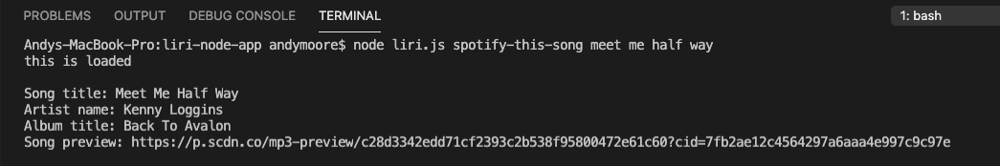

# liri-node-app

LIRI stands for Language Interpretation and Recognition Interface and is a command line node app that takes in parameters and gives you back data. 

This can take in four commands that each can accept one additional argument. 

The first command is "spotify-this-song."

  * Enter this command followed by the name of any song. The app will make contact with the Spotify API and return the title of the song, the artists name, the title of the album that the song was recorded on, and provide a url for a thirty second preview of the song for which you searched. You will get up to five results.
  
  

The second command is "concert-this."

  * Enter this command followed by the name of a band or a music artist. The app will connect with the Bands in Town Artist Events API and return the artist/band name, venue name, venue location, and date of the upcoming concert at that location. 
  
The third command is "movie-this."

  * Enter this command followed by the name of a movie. The app will connect with the OMDB API and return the movie title, release year, rating, country of production, language, plot, and list of actors. 
  
  
